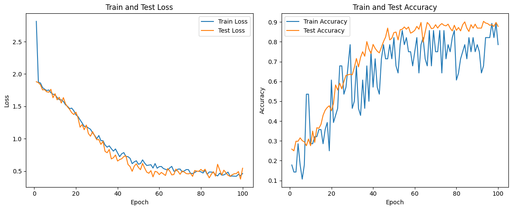
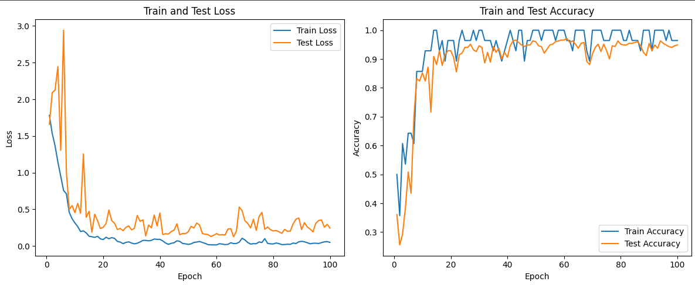
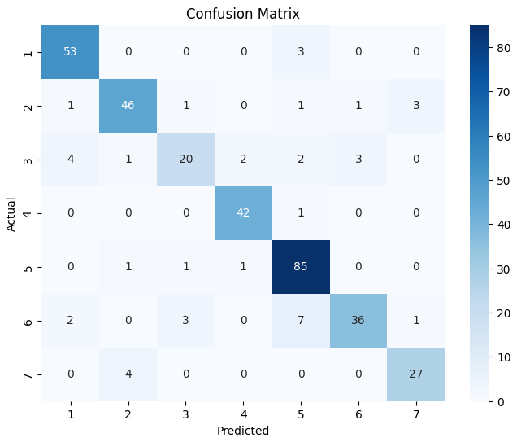
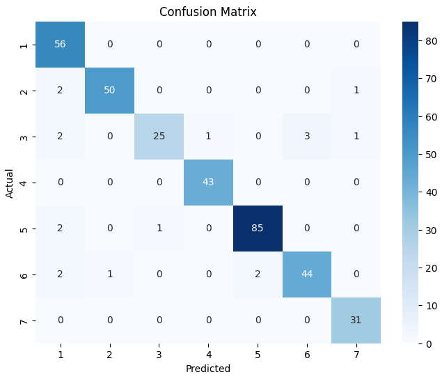

# Recycle Symbol Plastic Classification 

## Description 
This project classifies recycling symbols using a custom CNN and a pretrained ResNet34, comparing their performance. Metrics like accuracy and F1-score highlight the strengths of each model, aiding in selecting the best option for deployment.
## Dataset 
The dataset consists of images categorized into **7 classes**, representing different types of plastics based on their recycling codes. Each class corresponds to a specific type of plastic, with the images organized into separate folders for each category:  

1. **1 - Polyethylene Terephthalate (PET)**: Commonly used for beverage bottles and food containers.  
2. **2 - High-Density Polyethylene (HDPE)**: Found in milk jugs, detergent bottles, and piping.  
3. **3 - Polyvinyl Chloride (PVC)**: Used in pipes, window frames, and some food wraps.  
4. **4 - Low-Density Polyethylene (LDPE)**: Found in plastic bags, shrink wraps, and some squeeze bottles.  
5. **5 - Polypropylene (PP)**: Used in bottle caps, yogurt containers, and straws.  
6. **6 - Polystyrene (PS)**: Found in disposable cutlery, plates, and packing foam.  
7. **7 - Other Plastics**: Includes acrylic, nylon, polycarbonate, and polylactic acid (PLA), used in diverse applications such as reusable water bottles and biodegradable plastics.  

The dataset provides a diverse set of labeled images, making it suitable for training machine learning models to classify plastic types effectively. It can be accessed on [Kaggle](https://www.kaggle.com/datasets/piaoya/plastic-recycling-codes).

The original dataset, consisting of 7 classes of plastic recycling symbols, was augmented using Roboflow to enhance variability and model robustness.

## Model Architecture
| **Aspect**                | **Custom CNN**                                              | **ResNet (Modified ResNet34)**                            |
|---------------------------|------------------------------------------------------------|----------------------------------------------------------|
| **Input Channels**        | 1 (grayscale image)                                        | 1 (grayscale image)                                      |
| **Initial Conv Layer**    | 3x3, 64 filters, stride 1, padding 1                       | 3x3, 64 filters, stride 1, padding 1                    |
| **Feature Extraction**    | 6 Conv layers with increasing depth                        | Residual Blocks (BasicBlock) in 4 layers                 |
| **Number of Filters**     | 64 → 128 → 256 → 512                                       | Layer 1: 64 → Layer 2: 128 → Layer 3: 256 → Layer 4: 512 |
| **Batch Normalization**   | After each Conv layer                                      | After each Conv layer                                    |
| **Pooling**               | MaxPooling (after every 2 Conv layers)                    | MaxPooling (initial layer) + Downsampling in blocks      |
| **Residual Connections**  | No                                                        | Yes (ensures efficient training of deeper networks)      |
| **Fully Connected Layers**| 2 Dense layers (256 units → 7 units)                      | 1 Dense layer (512 units → 7 units)                     |
| **Dropout**               | Yes (0.2)                                                 | No                                                      |
| **Global Pooling**        | No                                                        | Adaptive Average Pooling before the final layer          |
| **Total Parameters**      | 10927751                   | 21279431               |
| **Purpose**               | Custom-built            |  Pre-trained         |


## Model Results 
The model was trained with the following parameters: 100 epochs, a batch size of 32, the Adam optimizer, and CrossEntropyLoss as the loss function. After training, the model's performance was evaluated, and the results are summarized below.


| Metric               | Model   | Class 1 | Class 2 | Class 3 | Class 4 | Class 5 | Class 6 | Class 7 | Accuracy | Macro Avg | Weighted Avg |
|-----------------------|---------|---------|---------|---------|---------|---------|---------|---------|----------|-----------|--------------|
| **Precision**         | CNN     | 0.88    | 0.88    | 0.80    | 0.93    | 0.86    | 0.90    | 0.87    | 0.88     | 0.88      | 0.88         |
|                       | ResNet  | 0.88    | 0.98    | 0.96    | 0.98    | 0.98    | 0.94    | 0.94    | 0.95     | 0.95      | 0.95         |
| **Recall**            | CNN     | 0.95    | 0.87    | 0.62    | 0.98    | 0.97    | 0.73    | 0.87    |          | 0.86      | 0.88         |
|                       | ResNet  | 1.00    | 0.94    | 0.78    | 1.00    | 0.97    | 0.90    | 1.00    |          | 0.94      | 0.95         |
| **F1-Score**          | CNN     | 0.91    | 0.88    | 0.70    | 0.95    | 0.91    | 0.81    | 0.87    |          | 0.86      | 0.87         |
|                       | ResNet  | 0.93    | 0.96    | 0.86    | 0.99    | 0.97    | 0.92    | 0.97    |          | 0.94      | 0.95         |

## Training/ Validation Curve

### CNN Scratch 



### Resnet



## Confusion Matrix 

### CNN Scratch



### Resnet



## Conclusion 
- The **ResNet** model achieved higher accuracy at 95% compared to **CNN**, which reached 88%.  
- The **Macro Avg** and **Weighted Avg** metrics for precision, recall, and f1-score indicate that ResNet consistently performs better across all classes.  
- **CNN** underperformed in certain classes, particularly **Class 3**, with a recall of 62% and an f1-score of 70%, while ResNet demonstrated more stable performance across all classes.  
- Based on the **training/validation loss** and **accuracy graphs**, CNN shows signs of **overfitting**, with high performance on training data but lower performance on validation data.  
- ResNet effectively mitigates overfitting, demonstrating better generalization to validation data.  

## Deployment
The model was deployed as an web application using Flask, allowing users to upload recycling symbol images for classification.

1. Clone Repository
```bash 
git clone https://github.com/jonathanlex1/recycle_plastic_symbol_classification.git
cd web_app
```

2. Install dependencies 
```bash
pip install -r requirements.txt
```

3. Run the applications : 
```bash
python app.py
```